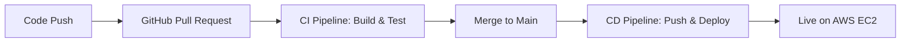

# Full-Stack Application with Automated DevOps Pipeline 🚀

[](https://github.com/NitzanNaveh/repository/actions)
[](https://github.com/NitzanNaveh/repository/actions)
[](https://hub.docker.com/r/NitzanNaveh/repository)

This project implements a full-stack application with a comprehensive DevOps pipeline that automates everything from infrastructure creation to application deployment on AWS. The entire workflow is defined as code, ensuring a robust, repeatable, and scalable deployment process.

## 🛠️ Technology Stack

| Category | Technology | Purpose |
|----------|------------|---------|
| Cloud Provider | AWS | Hosting the production environment (EC2, VPC) |
| Infrastructure as Code | Ansible | Provisioning the VPC, EC2 instance, and installing Docker |
| Containerization | Docker & Docker Compose | Packaging the full-stack app into a single, portable container |
| Container Registry | Docker Hub | Storing and distributing the application's Docker image |
| CI/CD Automation | GitHub Actions | Orchestrating the entire build, test, and deployment workflow |
| Automated Testing | Selenium with Python | Performing automated end-to-end testing on the live application |

## 🔄 Automated Workflow Architecture

The pipeline is event-driven, triggered by developer actions in GitHub, and ensures that only tested and validated code reaches production.



## 🏗️ Infrastructure Provisioning with Ansible

The entire AWS infrastructure is provisioned from scratch using an Ansible Playbook, guaranteeing a consistent and reproducible environment.

### Network Setup
- Creates a custom VPC
- Configures Public Subnet
- Sets up Internet Gateway
- Establishes Route Tables

### Server Provisioning
- Launches Ubuntu EC2 instance
- Configures Security Group
  - HTTP (port 80)
  - SSH (port 22)
- Installs dependencies (Docker + Docker Compose)

## 📦 Full-Stack Containerization with Docker

A multi-stage Dockerfile optimizes the build process and creates a self-contained image for the entire application.

### Build Stage
```dockerfile
# First stage: Build React frontend
FROM node:16 as builder
WORKDIR /app
COPY frontend/ ./
RUN npm install && npm run build

# Final stage: Production environment
FROM node:16-slim
COPY backend/ ./
COPY --from=builder /app/build ./public
EXPOSE 80
CMD ["npm", "start"]
```

### Docker Compose Configuration
```yaml
version: '3'
services:
  app:
    image: NitzanNaveh/repository
    ports:
      - "80:80"
    environment:
      - MONGODB_URI
      - LISTEN_NOTES_API_KEY
```

## 🔄 CI/CD Pipeline with GitHub Actions

### CI Workflow (On Pull Request)
The CI workflow acts as a quality gate before code merging:
1. Builds the full-stack Docker image
2. Executes Selenium test suite
3. Validates all tests pass before allowing merge

### CD Workflow (On Merge to main)
The CD workflow handles automatic deployment:
1. Builds and pushes Docker image to Docker Hub
2. Connects to production EC2 via SSH
3. Updates container with zero-downtime deployment:
   ```bash
   docker-compose pull
   docker-compose up -d --force-recreate
   ```

## 🚀 Getting Started

1. Clone the repository
   ```bash
   git clone https://github.com/NitzanNaveh/repository.git
   ```

2. Install dependencies
   ```bash
   npm install
   ```

3. Set up environment variables
   ```bash
   cp .env.example .env
   # Edit .env with your credentials
   ```

4. Run locally with Docker Compose
   ```bash
   docker-compose up
   ```

## 📝 Contributing

1. Fork the repository
2. Create your feature branch (`git checkout -b feature/AmazingFeature`)
3. Commit your changes (`git commit -m 'Add some AmazingFeature'`)
4. Push to the branch (`git push origin feature/AmazingFeature`)
5. Open a Pull Request

## 📄 License

This project is licensed under the MIT License - see the [LICENSE](LICENSE) file for details.

## 👥 Authors

* **Nitzan Naveh** - *Initial work* - [NitzanNaveh](https://github.com/NitzanNaveh)

## 🙏 Acknowledgments

* Hat tip to anyone who's code was used
* Inspiration
* etc
