# Full-Stack App with Automated DevOps Pipeline (AWS + Docker + Ansible) 🚀

This project demonstrates a complete, end-to-end DevOps pipeline that automates the entire lifecycle of a web application—from infrastructure creation on AWS to continuous deployment. The application is a NodeJS Password Generator, showcasing modern DevOps practices and tools in action.

## 🛠️ Technology Stack

| Category | Technology | Purpose |
|----------|------------|---------|
| Cloud Provider | AWS | Hosting the production environment (EC2, VPC) |
| Infrastructure as Code | Ansible | Provisioning VPC, EC2 instance, and installing dependencies |
| Containerization | Docker & Docker Compose | Packaging the application into a portable container |
| Container Registry | Docker Hub | Storing and distributing the application's Docker image |
| CI/CD Automation | GitHub Actions | Orchestrating the build, test, and deployment workflow |
| Automated Testing | Selenium with Python | Performing automated E2E testing |
| Application | NodeJS | Podcast recommendation web application |

## 🔄 Automated Workflow Architecture

```mermaid
graph LR
    A[Code Push to Feature Branch] --> B[Create Pull Request]
    B --> C{CI Pipeline: Test PR}
    C -- Tests Pass --> D[Merge to main]
    C -- Tests Fail --> X[Block Merge]
    D --> E{CD Pipeline: Deploy}
    E --> F[Push to Docker Hub]
    F --> G[Deploy on AWS EC2]
    G --> H[🚀 Application Live]
```



## 🏗️ Infrastructure Provisioning with Ansible

### Network Setup
- Custom VPC for resource isolation
- Public Subnet configuration
- Internet Gateway and Route Tables setup
- Security Group allowing HTTP (80) and SSH (22)

### Server Provisioning
```yaml
# Example Ansible task
- name: Install Docker
  ansible.builtin.apt:
    name: docker.io
    state: present
    update_cache: yes
```

## 📦 Containerization

### Dockerfile
```dockerfile
# Use Node.js LTS
FROM node:16.14

# Set working directory
WORKDIR /app

# Copy package files
COPY package*.json ./

# Install dependencies
RUN npm install

# Bundle app source
COPY . .

# Expose port
EXPOSE 3000

# Start command
CMD [ "npm", "start" ]
```

### Docker Compose
```yaml
version: '3.3'
services:
  web:
    image: nitzannaveh/password-generator:latest
    container_name: pass_gen
    ports:
      - "80:3000"
    restart: unless-stopped
```

## 🔄 CI/CD Pipeline

### CI Workflow (Pull Requests)
- Builds Docker image
- Runs container in GitHub Actions
- Executes Selenium tests
- Blocks merge if tests fail

### CD Workflow (Main Branch)
- Builds and pushes to Docker Hub
- Deploys to AWS EC2
- Performs zero-downtime deployment:
```bash
docker-compose pull
docker-compose up -d --force-recreate
```

## 🚀 Getting Started

### Prerequisites
- AWS Account with configured credentials
- Ansible installed locally
- Docker and Docker Compose installed

### Local Development
```bash
# Clone repository
git clone https://github.com/NitzanNaveh/password-generator.git
cd password-generator

# Install dependencies
npm install

# Start development server
npm run dev
```

### Required GitHub Secrets
- `AWS_ACCESS_KEY_ID`
- `AWS_SECRET_ACCESS_KEY`
- `DOCKERHUB_USERNAME`
- `DOCKERHUB_TOKEN`
- `SSH_PRIVATE_KEY`
- `HOST`

## 📂 Project Structure
```
.
├── ansible/                # Infrastructure as Code
│   ├── playbooks/
│   └── roles/
├── .github/
│   └── workflows/         # CI/CD pipelines
├── src/                   # Application source
├── tests/                 # Selenium E2E tests
├── Dockerfile
├── docker-compose.yml
└── README.md
```

## 📝 Contributing

1. Fork the repository
2. Create your feature branch (`git checkout -b feature/AmazingFeature`)
3. Commit your changes (`git commit -m 'Add some AmazingFeature'`)
4. Push to the branch (`git push origin feature/AmazingFeature`)
5. Open a Pull Request

## 📄 License

This project is licensed under the MIT License - see the [LICENSE](LICENSE) file for details.

## 👤 Author

**Nitzan Naveh** - [NitzanNaveh](https://github.com/NitzanNaveh)

_Last updated: 2025-08-26_
